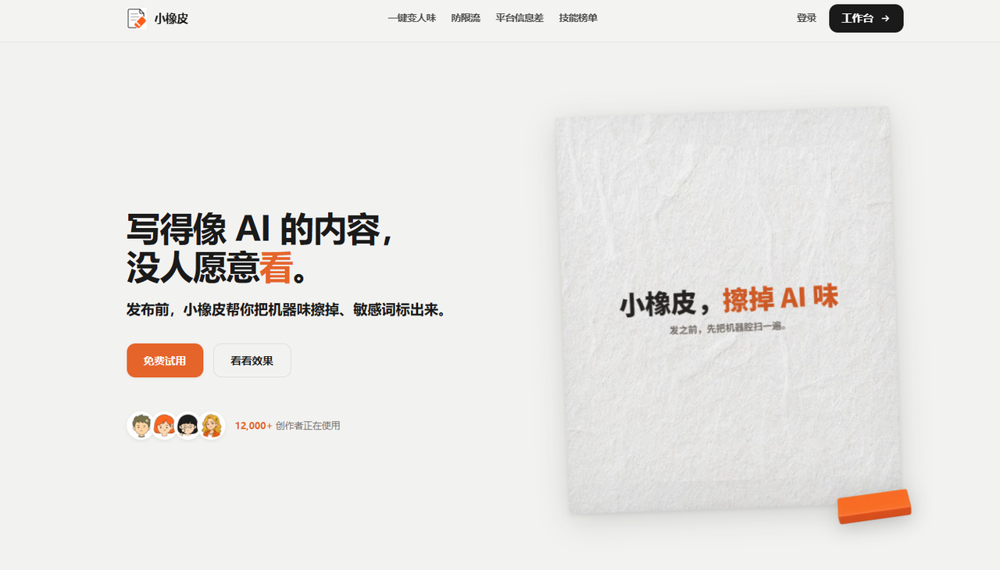
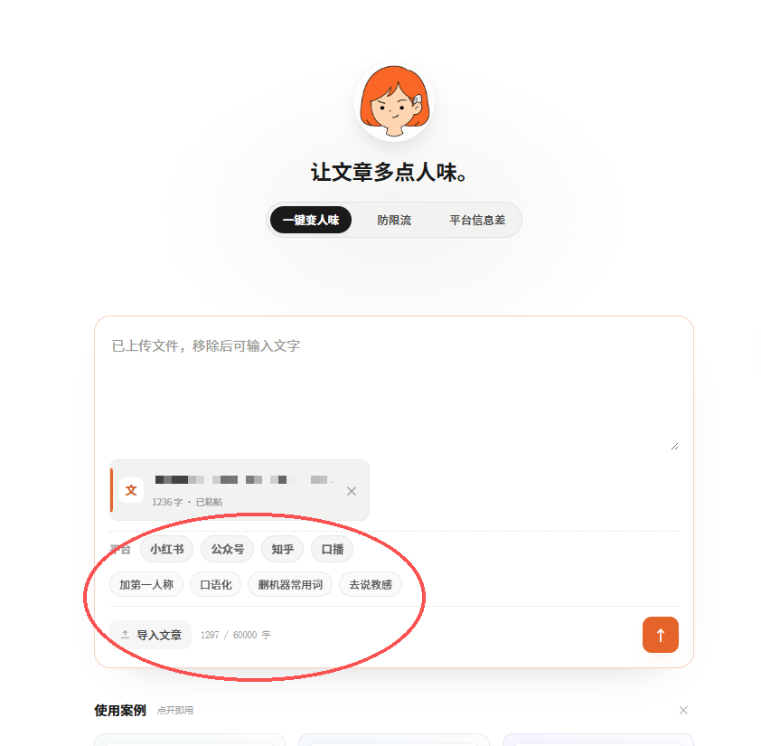
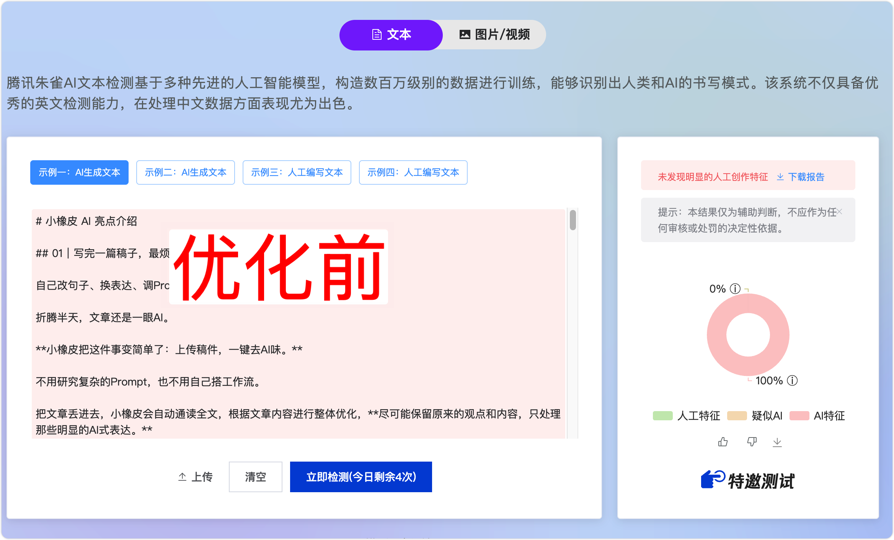

# AI写的文章怎么彻底去痕迹？全网最实用的降AI味解答！

现阶段绝大多数创作者、自媒体从业者、文案写手都会借助AI快速生成文章初稿，极大提升创作效率、降低内容产出门槛。

但几乎所有人都会遇到同一个创作瓶颈：**AI味严重**、**机器痕迹过重**、内容同质化明显，缺少真人写作的松弛感与个人思考。

也正因为这些隐性的机器特征，很多人的稿件会被平台判定为流水线低质内容，出现隐形限流、流量下滑、账号权重降低、原创度不达标等问题。

很多人为了**去AI味**、**消除AI痕迹**，反复手动改稿、不停调试提示词，不仅耗费大量时间，最终效果依旧不稳定，越改越迷茫。

到底如何科学、高效、彻底地**降低AI痕迹**，把机器稿打磨成自然真实的真人手写质感？今天结合长期实操经验，给大家整理一套从初稿生成、问题排查、手动优化、工具精细化打磨到最终定稿自查的完整流程，零基础创作者也能直接套用，彻底解决AI稿件难落地、易限流的问题。

## 一、先找准核心问题：高AI痕迹的典型特征

想要高效**去AI味**，首先要精准识别AI写作的标准化通病，也是平台机器查看的核心依据。

大部分AI稿件不自然、容易被识别，基本都逃不开这几点问题：模板过渡词泛滥、句式工整刻板、内容空洞无细节、行文情绪扁平、段落排版均匀、缺少真实思考轨迹。

这些细节叠加在一起，就形成了非常典型的**AI机器痕迹**，也是稿件流量上不去的根本原因。

## 二、基础手动优化法：从源头弱化AI味

在借助工具打磨之前，我们可以通过基础操作，从源头弱化大部分表层机器感，适合少量稿件精细打磨。

**首先是优化生成提示词**，不要用简单关键词生成内容，需要主动约束文风，要求句式长短交错、删除模板套话、采用真人分享口吻，从源头减少原生**AI味**。

**其次是手动打散全文句式**，通读稿件后删除所有无效、多余的制式过渡句，拆分冗长的长难句，穿插短句调节节奏，打破AI固有的均匀排版结构。

**最后通过补充个人实操细节、真实感悟、场景化观察**，给稿件增加专属个人印记，解决内容同质化问题，再通过朗读自查的方式微调生硬语句，进一步**弱化机器感**。

但必须客观说明，纯手动优化存在明显短板，只能作为辅助手段。频繁调试提示词效果不稳定，批量写稿耗时费力，人工很难彻底清理深层模板句式，始终无法完全**消除AI痕迹**，只适合小众精细创作，完全不适合日常高频批量出稿。

## 三、高效进阶方案：工具批量打磨，替代低效手动改稿

对于自媒体日常更新、批量写稿、千字长文创作，想要兼顾效率和质量，真正稳定**去AI味**、彻底**消除AI痕迹**，最落地的方案就是借助专业工具精细化打磨，我长期自用的就是**小橡皮AI**。

相比反复改稿、调试提示词，工具打磨能省下90%以上的人工成本，同时保证去痕效果稳定、干净、不翻车。

传送门：[小橡皮https://xiangpiai\.cn/](https://xiangpiai.cn/workspace?from=github0901jw)

小橡皮AI核心逻辑是重构行文语感、优化句式结构，而非简单替换文字，能够针对性解决AI稿件模板化、刻板化、同质化的所有问题，在百分百保留原文观点、案例、数据、核心逻辑的基础上，深度**消除AI痕迹**，实现高质量**AI文稿真人化**。

完整实操流程非常简单，零基础即可上手：

首先将AI初稿完整粘贴至编辑器，根据发布平台选择适配文风，精准匹配平台调性；

一键提交智能打磨，系统会自动清理模板套话、生硬过渡语句、机械排比，打散刻板句式，重新调整真人化长短句节奏，一分钟即可完成全篇优化。

改写完成后，会显示所有优化点位、改动数量、调整逻辑清晰展示，遇到不符合个人风格的内容，支持页面就地微调、撤回修改，完全杜绝工具乱改内容、跑偏主题的问题。

打磨完成后，工具会自动筛查残留**AI机器痕迹**与同质化内容，全方位保障去痕效果，最后的效果也非常不错。

## 四、终极标准化创作工作流

单纯依赖AI出稿，机器感重、容易限流；单纯手动改稿，效率太低、无法批量产出。

结合实测经验，最均衡、最高效的完整创作流程为：AI优化提示词生成初稿，初步弱化表层机器感；借助**小橡皮AI**一键深度**去AI味**、**消除AI痕迹**、句式润色、合规风控自查；人工简单补充个人细节、主观感悟、实操经验；最后通读全文微调语感、校验内容，定稿直接发布。

